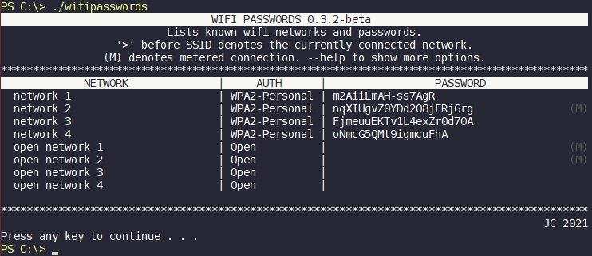

#wifipasswords

    [](https://pepy.tech/project/wifipasswords)

Retrieve and save all WiFi networks and passwords on the device.  
On windows uses the netsh subprocess.  
On linux reads the NetworkManager files or wpa_supplicant.conf.  

Cross platform:
- Windows
- Linux
- macOS (working - however see below note)

there is also a GUI version of this tool that can be found here - [WifiPasswords-GUI](https://github.com/needs-coffee/wifipasswords-GUI)

**NOTE:** requires sudo privileges on linux only if NetworkManager is not used.  

**NOTE:** Macos requires admin authentication for each password read, this can result in a lot of prompts for the get_passwords() function. I am currently looking for a solution for this.

Features
--------
- Importable as a package or able to be run directly on the command line
- Tested in Python 3.6 - 3.9
- Tested on Windows 10, Ubuntu 18 - 20.04, Debian Buster, macOS 10.13 (High Sierra) and macOS 10.14 (Mojave)
- Returns WiFi passwords as a dictionary
- Able to show visible wifi networks
- Able to show currently connected SSID
- Able to show current DNS config
- Able to show known SSIDs and find single network passwords
- Can save networks as JSON or wpa_supplicant.conf file

Installation
------------
Installed via pip using: ``pip install wifipasswords``

Usage
-----
```python
from wifipasswords import WifiPasswords

passwords = WifiPasswords().get_passwords()
connected_passwords = WifiPasswords().get_currently_connected_passwords()

print(passwords)
print(connected_passwords)

WifiPasswords().save_wpa_supplicant('.', passwords, True, 'GB')
```

Command Line Usage
------------------
Provides a command line interface callable after installation with:
- ``python3 -m wifipasswords``
- ``wifipasswords``

```shell
    ~ $ wifipasswords
```




To see command line options run ``wifipasswords -h``

Packaging as EXE
----------------
Can be packaged to an EXE on windows with:  
``pyinstaller --clean --noconsole --onefile -i <icon> wifipasswords_exe.py``

The wifipasswords_exe.py file is the same as the __main__.py file in the package except will pause after console output is finished to prevent the terminal from auto-closing if the EXE is run directly.

To-Do
-----
- [X] Add macOS Support
- [ ] Improve mac authentication methods
- [X] Add getters for accessing variables directly
- [X] Fix visible network, DNS config and number of interfaces for Linux
- [X] Add automated tests
- [X] Add method to check and return only the connected SSID name and Password
- [X] Use nmcli to retrieve passwords on linux rather than reading files (may not require sudo) 
- [X] Multithreading support for windows to imporove execution speed
- [ ] Add support for WPA-Enteprise 

About
-----
Creation date: 10-02-2019  
Modified date: 30-03-2021  
Dependencies: colorama  


Licence
-------
Copyright (C) 2019-2021 Joe Campbell  
 GNU GENERAL PUBLIC LICENSE (GPLv3)  

This program is free software: you can redistribute it and / or modify
it under the terms of the GNU General Public License as published by
the Free Software Foundation, either version 3 of the License, or
(at your option) any later version.

This program is distributed in the hope that it will be useful,
but WITHOUT ANY WARRANTY
without even the implied warranty of
MERCHANTABILITY or FITNESS FOR A PARTICULAR PURPOSE.  See the
GNU General Public License for more details.

You should have received a copy of the GNU General Public License
along with this program.  If not, see < https: // www.gnu.org/licenses/>.
